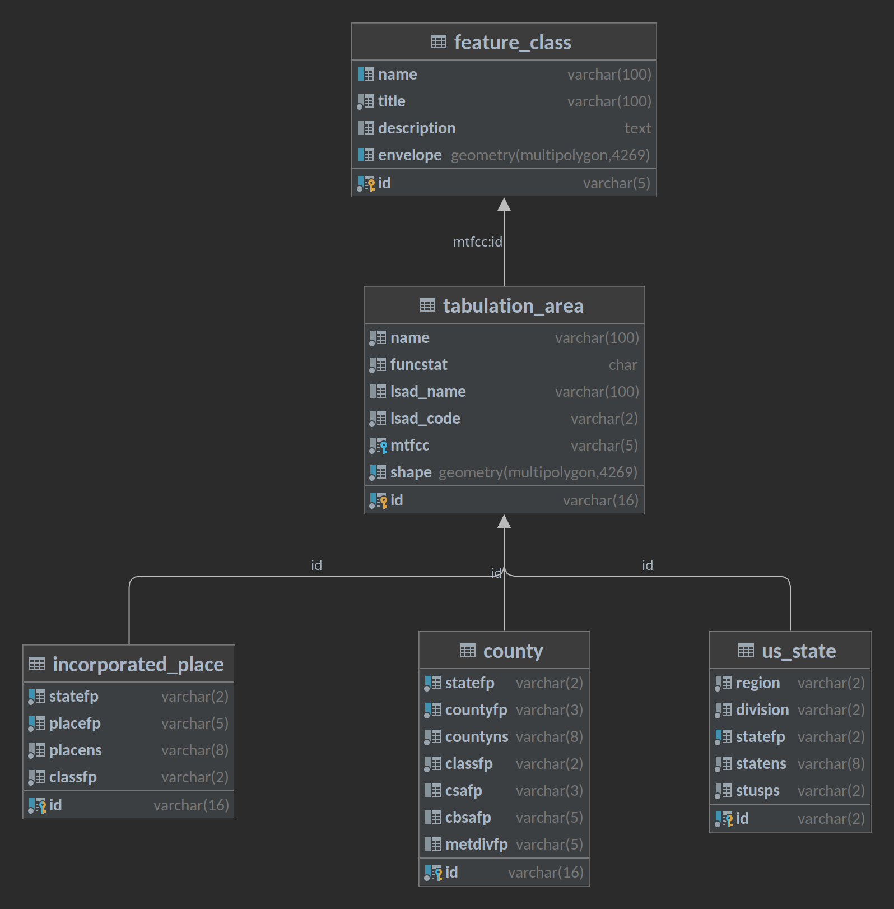

# Issue Trac Database

This is part of the Issue Trac application created as my senior project. Contained within this repository are the 
necessary sql and shell script to setup the applications database. 

## Setup

```shell
$ git clone git@github.com:nasumilu/issue-trac-databsase.git
$ cd issue-trac-database
$ cp .env .env.local
```

Set the correct arguments in the `.env.local` file. For more details on setting the variables prefixed with _PG_ see
[PostgreSQL Documentation](https://www.postgresql.org/docs/current/libpq-envars.html). Once the connection variables
are provided, run:

```shell
$ ./setup.sh
```

This may take awhile, the script needs to download each of the TIGER/Line&reg; Shapefiles, store the data into staging
tables, and finally create the applications database.


## Entity Relational Diagram (ERD)



## Resources & Links

- [TIGER/Line&reg; Shapefiles Documentation](https://www.census.gov/programs-surveys/geography/technical-documentation/complete-technical-documentation/tiger-geo-line.2022.html)
- [PostgreSQL Database Documentation](https://www.postgresql.org/docs/)
- [PostGIS Documentation](https://postgis.net/documentation/)