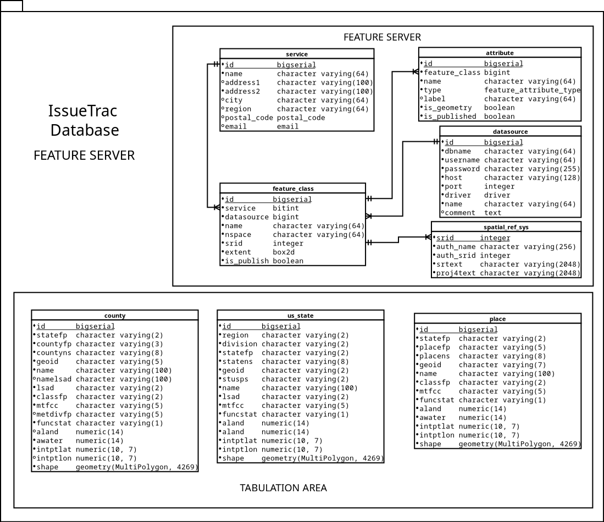
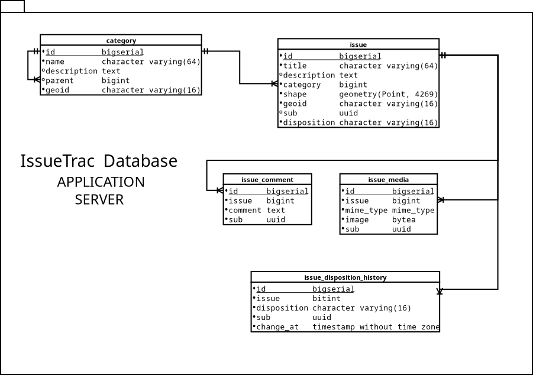

# IssueTrac Database

This is one of many components for [IssueTrac Project](https://github.com/nasumilu/issue-trac) created as my senior 
project. Contained within this repository are the necessary sql and shell script to setup the application and 
feature server database(s). 

## Requirements

- [curl](https://man7.org/linux/man-pages/man1/curl.1.html) is used to download the TIGER/Line&reg; Shapefile(s) from 
  the US Census Bureau
- [ogr2ogr](https://gdal.org/programs/ogr2ogr.html) used to convert/import the TIGER/Line&reg; Shapefile(s) into the 
  PostgreSQL database.
- [PostgreSQL Database >= v14](https://www.postgresql.org/) the primary persist storage used by the IssueTrac application
  and the feature server. 
- [PostGIS >= v3.2](https://postgis.net/) a spatial database extender which adds geographic objects and spatial query
- [MySQL](https://www.mysql.com/) a relational database which shall soon persist the data related to the actual IssueTrac
application. Mostly this is added as a test case for the [spatial platform middleware project](https://github.com/nasumilu/spatial-platform).

## Install

### Download
```shell
$ curl https://github.com/nasumilu/issue-trac-databsase/archive/refs/tags/v1.0.0.zip --output issue-trac-database.zip
$ unzip issue-trac-database.zip -d issue_trac-database
$ cd issue-trac-database
```

### Git
```shell
$ git clone https://github.com/nasumilu/issue-trac-databsase.git
$ cd issue-trac-database
```

### Composer

Add the repository to the projects `composer.json` file:
```json
"repositories": [
  {
    "type": "vcs",
    "url": "https://github.com/nasumilu/issue-trac-databsase.git"
  }
],
  "require-dev": {
    "nasumilu/issue-trac-database": "v1.0.0" 
}
```

```shell
$ composer update
$ vendor/bin/issuetrac_db --help
```

### NPM

Add teh repository to the projects `package.json` file
```json
  "scripts": {
    "issuetrac_db": "issuetrac_db postgresql setup -U postgres"
  },
  "devDependencies": {
    "issue_trac_db": "git+https://github.com/nasumilu/issue-trac-databsase.git#v1.0.0"
  }
```

```shell
$ npm run issuetrac_db postgresql setup
```

## Usage

### Postgresql

```shell
$ cd src
$ ./issuetrac_db postgresql setup -H localhost -u postgres -P my_password
```

### MySQL

```shell
$ cd src
$ ./issuetrac_db mysql setup -H localhost -u postgres -P my_password
```

This may take awhile, the script needs to download each of the TIGER/Line&reg; Shapefiles and then import the shapefile
into the database.

### Setup an individual database

First list the databases available for the target platform
```shell
$ ./issuetrac_db postgresql list
Database(s) for postgresql
  feature_server
  issue_trac
  tabulation_area
$ ./issuetrac_db postgresql feature_server --user=postgres --password=my_password
```

## Entity Relational Diagram (ERD)

### Feature ServerDatabase



### Application Database



## Resources & Links

- [TIGER/Line&reg; Shapefiles Documentation](https://www.census.gov/programs-surveys/geography/technical-documentation/complete-technical-documentation/tiger-geo-line.2022.html)
- [PostgreSQL Database Documentation](https://www.postgresql.org/docs/)
- [PostGIS Documentation](https://postgis.net/documentation/)
- [MySQL](https://www.mysql.com/)
- [issuetrac_db cli](dist/issuetrac_db.md)

[Back to IssueTrac Project](https://github.com/nasumilu/issue-trac)